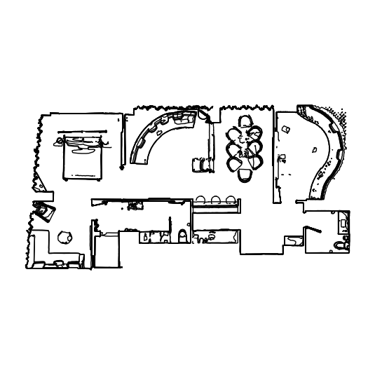

# Utilities for Gibson Environment

[](https://github.com/micheleantonazzi/gibson-env-utilities/actions/workflows/build-and-publish.yml)
[](https://pypi.org/project/gibson-env-utilities/)
[](https://sonarcloud.io/dashboard/index/micheleantonazzi_gibson-env-utilities)


[](https://sonarcloud.io/dashboard/index/micheleantonazzi_gibson-env-utilities)
[](https://sonarcloud.io/dashboard/index/micheleantonazzi_gibson-env-utilities)
[](https://sonarcloud.io/dashboard/index/micheleantonazzi_gibson-env-utilities)
[](https://sonarcloud.io/dashboard/index/micheleantonazzi_gibson-env-utilities)
[](https://sonarcloud.io/dashboard/index/micheleantonazzi_gibson-env-utilities)

This Python library offers a series of utilities for easily using [GibsonEnv](https://github.com/micheleantonazzi/GibsonEnv.git).

## Doors Sample

*DoorsSample* class is built using the [generic-dataset](https://github.com/micheleantonazzi/generic-dataset) framework. It models a door sample, storing the data (the RGB-D images, the semantic image and the position of the acquisition) and some useful operations to manipulate it. 

## Environments data

*GibsonEnvironmentsData* implements a series of operations the worlds in Gibson's dataset.
This information includes:

* the environment's name
* if the environment is semantically annotated
* for each floor:
    * the approximate height of the floor
    * the starting position
    * the starting orientation

The environments' data are organized in a dictionary, as shown below:

```
[environment's name] -> str (dictionary key)
  |_[dataset] -> str (stanford or matterport)
  |_[has_semantics] -> bool
  |_[floors] -> dict
    |_[number] -> int (dictionay key)
      |_[floor_height] -> float
      |_[position] -> list (the starting position x, y, z)
      |_[orientation] -> list (the starting orientation expressed in gradients x, y, z)
```

## Assets utilities
GibsonAssetsUtilities defines useful methods for:
* save and load assets files from disk
* generate floor maps (and their metadata) starting from a wavefront file (*.obj). The map's metadata includes:
  * the origin's coordinates in pixel
  * the scale which indicates the real distance covered by a pixel

## Voronoi graph generator

*VoronoiGraphGenerator* is a utility that generates a graph starting from environment maps (created with *AssetsUtilities* methods). Using this graph, it is possible to extract possible positions in the simulation world to collect data. To generate a graph, a world map is processed as follow:

* The map image is binarized using a thresholding procedure (the values between 0 and 250 are turned to 0)
* The thresholded image is eroded and dilated in order to remove imperfections and smooth the edges
* In the resulting image, the contours are found
* Then it is necessary to identify the space in which the robot can move. To do this, the contours are examined to find the building's external outline. It is assumed that it is the longest one.
* Now, the space unreachable for the robot is black-colored. In particular, the building's contour outside is black-filled, like all the other outlines inside it. The resulting image is composed of white pixels (that represent the space in which the robot can travel) and black pixels, where the robot can't travel through.
* Using the contours' points, the Voronoi decomposition is calculated using Delaunay Triangulation.
* The segments of the Voronoi facets' perimeter are examined. These lines are drawn only if they are inside the building's outline and do not overlap an obstacle (in other words, if the extreme points that define a segment are inside the image and the correspondent pixel is white).
* The Voronoi lines define the Voronoi bitmap (an image that visually describes a graph). This bitmap is used to generate a graph. The graph entity finds the connected components and prunes the sidelines.
* The resulting graph is then reconverted to an image (Voronoi bitmap), which is dilated and skeletonized in order to clean the graph.
* Finally, the resulting skeletonized image is used to generate a new graph

|  |      |
| ------------------------------------------------------------ | ---- |

## Config run
*GibsonConfigRun* helps users to configure Gibson to perform a simulation run.
This class automatically creates a configuration file used by Gibson Environment to read the simulation parameters.
You can see this class in action in the correspondent examples ([1](examples/launch_gibson_turtlebot.py) and [2](examples/launch_gibson_turtlebot_no_physics.py)).